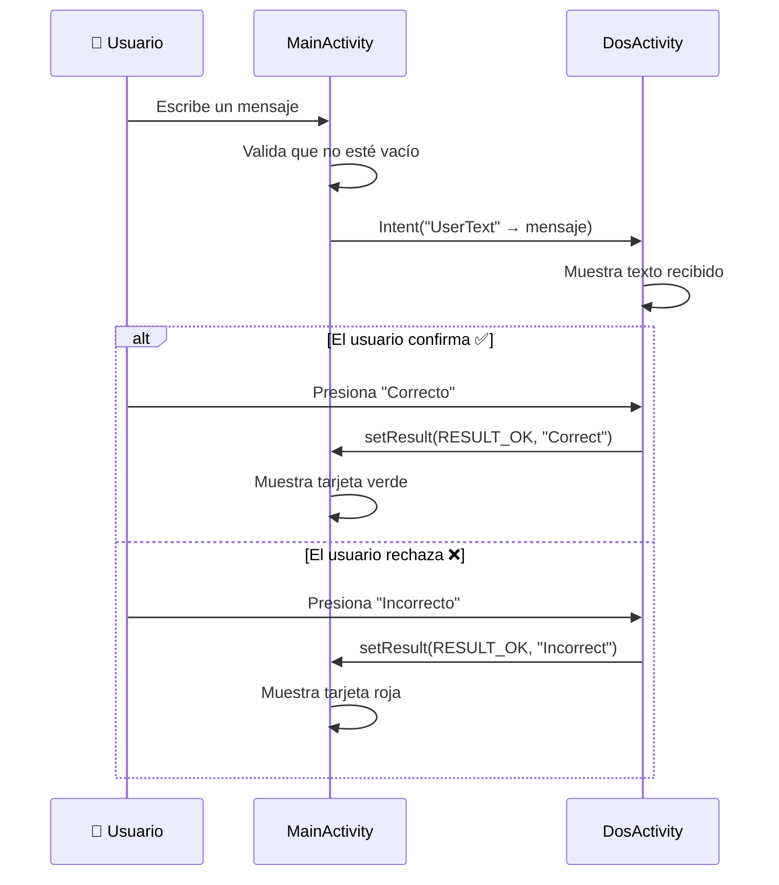

<div align="center">

<!-- ════════════════════════════════════════════════════════════════════ -->
<!--                         HEADER / BANNER                           -->
<!-- ════════════════════════════════════════════════════════════════════ -->

<picture>
  <source media="(prefers-color-scheme: dark)" srcset="https://img.shields.io/badge/Android-3DDC84?style=for-the-badge&logo=android&logoColor=white">
  
</picture>
&nbsp;
<picture>
  <source media="(prefers-color-scheme: dark)" srcset="https://img.shields.io/badge/Kotlin-7F52FF?style=for-the-badge&logo=kotlin&logoColor=white">
  
</picture>
&nbsp;
<picture>
  <source media="(prefers-color-scheme: dark)" srcset="https://img.shields.io/badge/Material%20Design%203-757575?style=for-the-badge&logo=materialdesign&logoColor=white">
  
</picture>

<br><br>

# Actividad 1 — Comunicación entre Activities

### Programación Móvil · Actividad 2

**Institución Universitaria Digital de Antioquia (IU Digital)**

<br>

[-brightgreen?style=flat-square&logo=android)](https://developer.android.com/about/versions/nougat)
[](https://developer.android.com/about/versions)
[](https://docs.gradle.org/current/userguide/kotlin_dsl.html)
[](#)

---

</div>

## Descripción

Aplicación Android nativa desarrollada íntegramente en **Kotlin** que demuestra la **comunicación bidireccional entre Activities** utilizando `Intents` explícitos y la API moderna `ActivityResultLauncher` (`registerForActivityResult`).

La solución integra los principios de **Material Design 3**, priorizando una interfaz limpia, tipografía legible y una experiencia de usuario fluida y profesional. Sirve como evidencia académica de la asignatura **Programación Móvil** de la IU Digital de Antioquia.

---

## Características Principales

| Característica | Descripción |
|:---|:---|
| **Comunicación bidireccional** | Flujo completo de datos `MainActivity → DosActivity → MainActivity` con `Intent` + `ActivityResultLauncher` |
| **Validación de entrada** | Control preventivo que impide enviar campos vacíos |
| **Material Design 3** | Componentes `TextInputLayout`, `MaterialCardView`, `MaterialToolbar` y `AppBarLayout` |
| **Feedback visual dinámico** | Tarjeta de resultado que cambia color e icono según la respuesta (`Correcto` → verde, `Incorrecto` → rojo) |
| **Edge-to-Edge** | Diseño adaptativo que respeta las barras del sistema con `enableEdgeToEdge()` + `WindowInsetsCompat` |
| **Soporte DayNight** | Tema base `Theme.Material3.DayNight.NoActionBar` con configuración light/dark |

---

## Arquitectura & Flujo de la Aplicación



---

## Stack Tecnológico

<div align="center">

| Capa | Tecnología | Versión |
|:---:|:---|:---:|
| **Lenguaje** | Kotlin | — |
| **Build System** | Gradle (Kotlin DSL) + Version Catalog | AGP `9.3.2` |
| **UI Framework** | Material Components for Android | `1.10.0` |
| **Jetpack** | AppCompat · Activity KTX · ConstraintLayout · Core KTX | — |
| **Testing** | JUnit 4 · Espresso | `4.13.2` / `3.5.1` |
| **Platform** | Android SDK `24` → `37` | — |

</div>

---

## Estructura del Proyecto

```
first_android_app/
│
├── 📄 build.gradle.kts              # Configuración raíz del proyecto (plugins)
├── 📄 settings.gradle.kts           # Nombre del proyecto ("actividad1") y módulos
├── 📄 gradle.properties             # Propiedades globales de Gradle
├── 📄 gradlew / gradlew.bat         # Wrappers de Gradle (Unix / Windows)
├── 📄 .gitignore                    # Reglas de exclusión para Git
│
├── 📁 gradle/
│   ├── 📄 libs.versions.toml        # Catálogo de versiones (Version Catalog)
│   └── 📁 wrapper/                  # Configuración del Gradle Wrapper
│
└── 📁 app/                          # ══════ MÓDULO PRINCIPAL ══════
    │
    ├── 📄 build.gradle.kts          # Configuración del módulo (dependencias, SDK)
    │
    └── 📁 src/
        ├── 📁 main/
        │   │
        │   ├── 📄 AndroidManifest.xml          # Registro de Activities y permisos
        │   │
        │   ├── 📁 java/com/example/actividad1/
        │   │   ├── 🟣 MainActivity.kt          # Pantalla principal (envío + resultado)
        │   │   └── 🟣 DosActivity.kt           # Pantalla de confirmación
        │   │
        │   └── 📁 res/
        │       ├── 📁 layout/
        │       │   ├── 🖼️ activity_main.xml     # Layout de MainActivity
        │       │   └── 🖼️ activity_2.xml        # Layout de DosActivity
        │       │
        │       ├── 📁 drawable/
        │       │   ├── 🎨 bg_main.xml           # Fondo degradado pantalla principal
        │       │   ├── 🎨 bg_activity2.xml      # Fondo degradado pantalla secundaria
        │       │   ├── 🎨 ic_check.xml          # Icono ✓ (confirmación)
        │       │   ├── 🎨 ic_close.xml          # Icono ✕ (rechazo)
        │       │   ├── 🎨 ic_input_text.xml     # Icono del campo de texto
        │       │   ├── 🎨 ic_message.xml        # Icono de mensaje (cabecera)
        │       │   ├── 🎨 ic_send.xml           # Icono del botón enviar
        │       │   ├── 🎨 ic_launcher_background.xml
        │       │   └── 🎨 ic_launcher_foreground.xml
        │       │
        │       ├── 📁 values/
        │       │   ├── 🎨 colors.xml            # Paleta de colores personalizada
        │       │   ├── 📝 strings.xml           # Cadenas de texto
        │       │   └── 🎨 themes.xml            # Tema Light (Material 3)
        │       │
        │       ├── 📁 values-night/
        │       │   └── 🎨 themes.xml            # Tema Dark (Material 3)
        │       │
        │       ├── 📁 mipmap-*/                 # Iconos del launcher (hdpi → xxxhdpi)
        │       └── 📁 xml/                      # Reglas de backup y extracción de datos
        │
        ├── 📁 androidTest/                      # Tests de instrumentación (Espresso)
        └── 📁 test/                             # Tests unitarios (JUnit)
```

---

## Detalle de los Componentes Clave

### `MainActivity.kt` — Pantalla Principal

```kotlin
// Registro del launcher para recibir resultados de DosActivity
private val lanzadorSegundaPantalla = registerForActivityResult(
    ActivityResultContracts.StartActivityForResult()
) { result -> /* Procesa la respuesta */ }
```

**Responsabilidades:**
- Captura la entrada del usuario desde un `TextInputEditText`
- Valida que el campo no esté vacío antes de enviar
- Lanza `DosActivity` con un `Intent` explícito que transporta el texto (`putExtra`)
- Recibe el resultado vía `ActivityResultLauncher` y actualiza la UI con una `MaterialCardView` dinámica (color verde/rojo + icono)

### `DosActivity.kt` — Pantalla de Confirmación

```kotlin
// Recepción del texto enviado desde MainActivity
val textReceived = intent.getStringExtra("UserText") ?: "N/A"
```

**Responsabilidades:**
- Recibe y muestra el texto enviado desde `MainActivity`
- Presenta dos opciones al usuario: **Correcto** e **Incorrecto**
- Retorna la selección mediante `setResult(RESULT_OK, intent)` + `finish()`

---

## Instalación y Ejecución

### Requisitos Previos

| Requisito | Mínimo |
|:---|:---|
| **Android Studio** | Iguana (2023.2) o superior |
| **JDK** | 11+ |
| **Android SDK** | API 37 (compilación) |
| **Dispositivo/Emulador** | API 24+ (Android 7.0 Nougat) |

### Pasos

```bash
# 1. Clonar el repositorio
git clone https://github.com/pedromonvel94/first_android_app.git

# 2. Abrir en Android Studio
#    File → Open → seleccionar la carpeta "first_android_app"

# 3. Esperar la sincronización de Gradle (automática)

# 4. Ejecutar la aplicación
#    Presionar el botón ▶ Run o usar Shift + F10
```

> [!TIP]
> Si Android Studio solicita instalar componentes del SDK o aceptar licencias, acepta las sugerencias para que el proyecto compile correctamente.

---

## Prueba Funcional Esperada

| Paso | Acción | Resultado Esperado |
|:---:|:---|:---|
| **1** | Abrir la aplicación | Se muestra `MainActivity` con campo de texto y botón "Enviar" |
| **2** | Escribir `Hola desde MainActivity` | El texto aparece en el campo de entrada |
| **3** | Presionar **Enviar** | Se abre `DosActivity` mostrando el texto recibido |
| **4** | Presionar **Correcto** | Regresa a `MainActivity` con tarjeta **verde**: _"¡El texto es correcto!"_ |
| **5** | Repetir pasos 2-3 | Se abre `DosActivity` nuevamente |
| **6** | Presionar **Incorrecto** | Regresa a `MainActivity` con tarjeta **roja**: _"El texto es incorrecto"_ |
| **7** | Intentar enviar campo vacío | El botón no realiza ninguna acción (validación activa) |

---

## Conceptos Técnicos Demostrados

<div align="center">

```
┌─────────────────────────────────────────────────────────────────┐
│                    CONCEPTOS APLICADOS                          │
├─────────────────────┬───────────────────────────────────────────┤
│  Intent Explícito   │  Navegación directa entre Activities     │
│  putExtra / get*    │  Transporte de datos entre componentes   │
│  ActivityResult API │  Patrón moderno para recibir resultados  │
│  setResult()        │  Retorno de datos a la Activity origen   │
│  Material Design 3  │  Componentes UI avanzados                │
│  Edge-to-Edge       │  Diseño adaptativo a barras del sistema  │
│  Kotlin DSL         │  Configuración type-safe de Gradle       │
│  Version Catalog    │  Gestión centralizada de dependencias    │
└─────────────────────┴───────────────────────────────────────────┘
```

</div>

---

## Equipo de Desarrollo

<div align="center">

| Estudiante |
|:---|
| **Brayan Alejandro Durango Urrea** |
| **Juan Pedro Montoya Vélez** |
| **Víctor Manuel Quiceno Guerra** |
| **Juan Camilo Velásquez** |

<br>

**Institución Universitaria Digital de Antioquia**  
*Programa de Tecnología en Desarrollo de Software*  
*Asignatura: Programación Móvil*

</div>

---

<div align="center">

<sub>

*Evidencia académica desarrollada para el fortalecimiento de competencias en ingeniería de software y desarrollo móvil.*

</sub>

<br>

<picture>
  <source media="(prefers-color-scheme: dark)" srcset="https://img.shields.io/badge/Made%20with-❤️%20%26%20Kotlin-7F52FF?style=for-the-badge">
  
</picture>

</div>
